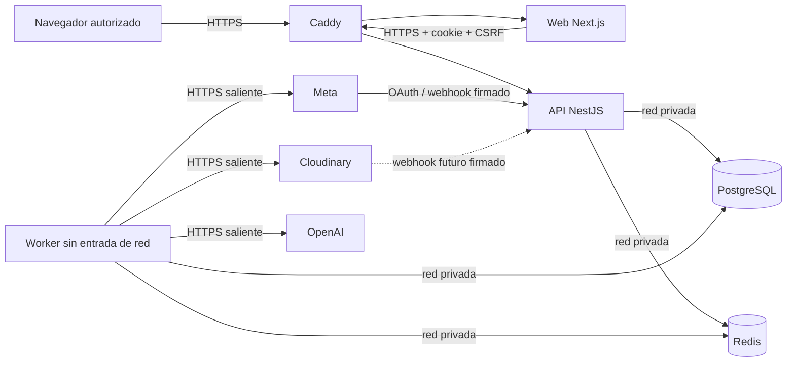

# Ambientes, callbacks y propietarios

## Topología

La producción piloto usa el VPS dedicado decidido en
[ADR-013](../architecture/decisions/ADR-013-DEDICATED-VPS-DEPLOYMENT.md).
Staging conserva recursos y credenciales independientes; su host remoto no se
provisiona en el mismo VPS hasta demostrar que existe margen operativo.

Sólo Caddy publica puertos. PostgreSQL, Redis y worker viven en una red Docker
`internal`; la API comparte otra red únicamente con Caddy. El host productivo
no contiene Odoo ni la web comercial.

No existe conectividad de aplicación entre recursos de staging y producción.
Sus bases, volúmenes, credenciales, proyectos externos y llaves son
independientes aunque en el futuro puedan compartir proveedor físico. Un fallo
total del VPS productivo sigue siendo un único dominio de falla.

## Host productivo asignado

| Campo | Valor verificado |
|---|---|
| Proveedor | OVHcloud |
| Hostname | `vps-f94a1dd2.vps.ovh.ca` |
| IPv4 | `144.217.91.115` |
| IPv6 | `2607:5300:205:200::9f41` |
| Usuario operativo inicial | `ubuntu` |
| Puerto SSH observado | `22` |
| Sistema | Ubuntu `26.04 LTS`, x86-64, kernel `7.0.0-28` |
| Capacidad | 4 vCPU, 7,6 GiB RAM, 2 GiB swap, 72 GB ext4 útiles |
| Contenedores | Docker Engine `29.6.2`, Compose `5.3.1` |

El 2026-07-29 ambas direcciones resolvieron desde el hostname y el servidor
fue actualizado, reiniciado y validado por IPv4 e IPv6. SSH acepta sólo la clave
ED25519 autorizada; contraseña, login de root y X11 están deshabilitados. UFW
permite únicamente SSH, HTTP, HTTPS y HTTP/3; AppArmor y actualizaciones
automáticas permanecen activos. No hay contenedores activos y sólo SSH escucha
hasta completar el entorno. La release declarativa
`3b83df4c667e8b14b3ff1e65363e6e6cf1a5ebf1` está seleccionada en
`/opt/aramayo-content/current`, con Compose y Caddy validados pero sin servicios
iniciados. El entorno productivo existe como archivo `0600 root:root`: contiene
correo ACME y secretos internos generados en el host, mientras OpenAI,
Cloudinary y Meta siguen deshabilitados. Las imágenes públicas de la release
fueron descargadas anónimamente desde GHCR y verificadas como `linux/amd64`, sin
crear contenedores ni volúmenes.

## Matriz de URLs

| Uso | Staging | Piloto de producción | Propietario |
|---|---|---|---|
| Web | hostname remoto pendiente | `https://content.ferreteriaaramayo.com.ar` | Administrador de plataforma |
| API | hostname remoto pendiente | `https://api.content.ferreteriaaramayo.com.ar` | Administrador de plataforma |
| Meta OAuth redirect | `<api>/integrations/meta/oauth/callback` | `<api>/integrations/meta/oauth/callback` | Administrador de Meta Business |
| Meta eliminación de datos | `<api>/integrations/meta/data-deletion` | `<api>/integrations/meta/data-deletion` | Administrador de Meta Business |
| Meta desautorización | `<api>/integrations/meta/deauthorize` | `<api>/integrations/meta/deauthorize` | Administrador de Meta Business |
| Política de privacidad | `<web>/legal/privacy` | `<web>/legal/privacy` | Responsable de negocio |
| Cloudinary delivery | `https://res.cloudinary.com/<cloud-staging>/...` | `https://res.cloudinary.com/<cloud-production>/...` | Administrador de medios |
| Cloudinary webhook futuro | `<api>/webhooks/cloudinary` | `<api>/webhooks/cloudinary` | Administrador de medios |

`<api>` y `<web>` se sustituyen sólo después de que DNS resuelva al VPS, Caddy
obtenga certificados y los smoke tests remotos aprueben. Cloudinary opera
síncronamente en la primera vertical, por lo que el webhook no se configura
hasta introducir una operación asíncrona que lo necesite. Todos los webhooks
futuros verifican firma y replay antes de procesar.

## Recursos separados

| Recurso | Staging | Producción | Entrada pública |
|---|---|---|---|
| Caddy | pendiente | contenedor exclusivo | Sí, 80/443 |
| Web | proceso/imagen independiente | contenedor Next.js | Sólo mediante Caddy |
| API | proceso/imagen independiente | contenedor NestJS | Sólo mediante Caddy |
| Worker | proceso/imagen independiente | contenedor Playwright | No |
| PostgreSQL | base y credencial exclusivas | volumen y credencial exclusivos | No |
| Redis | instancia exclusiva, `noeviction` | volumen exclusivo, `noeviction` | No |
| Cloudinary | product environment exclusivo | product environment exclusivo | CDN solamente |
| OpenAI | proyecto y presupuesto exclusivos | proyecto y presupuesto exclusivos | No aplica |
| Meta | app y activos de prueba | app y activos aprobados | Callbacks exactos |

## Matriz de secretos

| Secreto | Consumidor | Ubicación | Propietario funcional | Rotación |
|---|---|---|---|---|
| `DATABASE_URL` | API, worker | entorno de contenedor derivado en Compose | Administrador de plataforma | al cambiar credencial o ante incidente |
| `REDIS_URL` | API, worker | entorno de contenedor derivado en Compose | Administrador de plataforma | al cambiar credencial o ante incidente |
| `TOKEN_ENCRYPTION_KEYS` | API, worker | archivo de entorno remoto `0600` | Administrador de plataforma | keyring y reencriptado según `SECRETS.md` |
| `OPENAI_API_KEY` | worker | archivo de entorno remoto `0600` | Administrador de OpenAI | trimestral o ante incidente |
| `CLOUDINARY_API_SECRET` | worker | archivo de entorno remoto `0600` | Administrador de medios | trimestral o ante incidente |
| `META_APP_SECRET` | API, worker | archivo de entorno remoto `0600` | Administrador de Meta Business | trimestral o ante incidente |
| Tokens OAuth Meta | worker | PostgreSQL cifrado | Administrador de Meta Business | expiración, revocación o incidente |
| Credenciales de sesión | navegador/API | cookie opaca + hash PostgreSQL | Administrador de identidad | login, elevación, baja o cambio de contraseña |

Los identificadores no secretos pueden acompañar al servicio consumidor, pero
no se comparten entre ambientes. El procedimiento detallado está en
[`SECRETS.md`](SECRETS.md).

## Alta, cambio de rol y baja

### Alta

1. Un `admin` crea una identidad individual y una membresía.
2. Asigna únicamente los roles requeridos.
3. La persona establece su credencial por un canal separado.
4. Se registra actor, organización, roles y resultado.
5. La primera sesión consulta la membresía vigente desde PostgreSQL.

### Cambio de rol

1. Un `admin` de la misma organización solicita el nuevo conjunto de roles.
2. El backend valida que los roles sean conocidos y que la membresía pertenezca
   a la organización del actor.
3. La actualización y la auditoría ocurren en una transacción.
4. La siguiente request vuelve a leer los roles; no confía en roles guardados
   en el navegador.

### Baja

1. Se revoca la membresía.
2. Se revocan en la misma operación sus sesiones del ambiente y organización.
3. Se retira el acceso individual al VPS, registry y proveedores.
4. Una credencial compartida se rota únicamente si existió o pudo existir
   exposición.
5. Se conserva la auditoría sin copiar secretos.

Esta secuencia permite revocar a una persona sin rotar todo el sistema porque
sesiones, membresías y accesos de proveedor son individuales.
