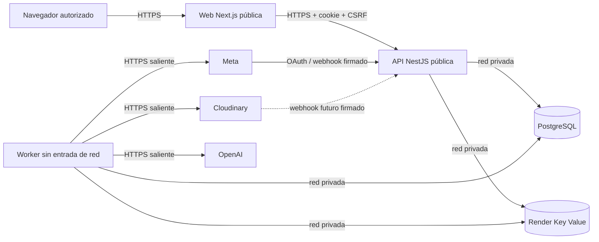

# Ambientes, callbacks y propietarios

## Topología

Staging y producción repiten la misma forma con recursos independientes:

No existe conectividad entre los recursos de staging y producción. Los
servicios de un ambiente comparten región y red privada.

## Matriz de URLs

| Uso | Staging | Piloto de producción | Propietario |
|---|---|---|---|
| Web | `https://aramayo-content-staging.onrender.com` | `https://aramayo-content.onrender.com` | Administrador de plataforma |
| API | `https://aramayo-content-api-staging.onrender.com` | `https://aramayo-content-api.onrender.com` | Administrador de plataforma |
| Meta OAuth redirect | `<api>/integrations/meta/oauth/callback` | `<api>/integrations/meta/oauth/callback` | Administrador de Meta Business |
| Meta eliminación de datos | `<api>/integrations/meta/data-deletion` | `<api>/integrations/meta/data-deletion` | Administrador de Meta Business |
| Meta desautorización | `<api>/integrations/meta/deauthorize` | `<api>/integrations/meta/deauthorize` | Administrador de Meta Business |
| Política de privacidad | `<web>/legal/privacy` | `<web>/legal/privacy` | Responsable de negocio |
| Cloudinary delivery | `https://res.cloudinary.com/<cloud-staging>/...` | `https://res.cloudinary.com/<cloud-production>/...` | Administrador de medios |
| Cloudinary webhook futuro | `<api>/webhooks/cloudinary` | `<api>/webhooks/cloudinary` | Administrador de medios |

`<api>` y `<web>` se sustituyen sólo después de que Render confirme el
hostname. Cloudinary opera síncronamente en la primera vertical, por lo que el
webhook no se configura hasta introducir una operación asíncrona que lo
necesite. Todos los webhooks futuros verifican firma y replay antes de procesar.

## Recursos separados

| Recurso | Staging | Producción | Entrada pública |
|---|---|---|---|
| Web service | `aramayo-content-staging` | `aramayo-content` | Sí |
| API service | `aramayo-content-api-staging` | `aramayo-content-api` | Sí, rutas necesarias |
| Background worker | `aramayo-content-worker-staging` | `aramayo-content-worker` | No |
| PostgreSQL | instancia exclusiva | instancia exclusiva | No |
| Key Value | instancia exclusiva, `noeviction` | instancia exclusiva, `noeviction` | No |
| Cloudinary | product environment exclusivo | product environment exclusivo | CDN solamente |
| OpenAI | proyecto y presupuesto exclusivos | proyecto y presupuesto exclusivos | No aplica |
| Meta | app y activos de prueba | app y activos aprobados | Callbacks exactos |

## Matriz de secretos

| Secreto | Consumidor | Ubicación | Propietario funcional | Rotación |
|---|---|---|---|---|
| `DATABASE_URL` | API, worker | Render, valor interno | Administrador de plataforma | al cambiar credencial o ante incidente |
| `REDIS_URL` | API, worker | Render, valor interno autenticado | Administrador de plataforma | al cambiar credencial o ante incidente |
| `TOKEN_ENCRYPTION_KEYS` | API, worker | secret store de Render | Administrador de plataforma | keyring y reencriptado según `SECRETS.md` |
| `OPENAI_API_KEY` | worker | secret store de Render | Administrador de OpenAI | trimestral o ante incidente |
| `CLOUDINARY_API_SECRET` | worker | secret store de Render | Administrador de medios | trimestral o ante incidente |
| `META_APP_SECRET` | API, worker | secret store de Render | Administrador de Meta Business | trimestral o ante incidente |
| Tokens OAuth Meta | worker | PostgreSQL cifrado | Administrador de Meta Business | expiración, revocación o incidente |
| Credenciales de sesión | navegador/API | cookie opaca + hash PostgreSQL | Administrador de identidad | login, elevación, baja o cambio de contraseña |

Los identificadores no secretos pueden acompañar al servicio consumidor, pero
no se comparten entre ambientes. El procedimiento detallado está en
[`SECRETS.md`](SECRETS.md).

## Alta, cambio de rol y baja

### Alta

1. Un `admin` crea una identidad individual y una membresía.
2. Asigna únicamente los roles requeridos.
3. La persona establece su credencial por un canal separado.
4. Se registra actor, organización, roles y resultado.
5. La primera sesión consulta la membresía vigente desde PostgreSQL.

### Cambio de rol

1. Un `admin` de la misma organización solicita el nuevo conjunto de roles.
2. El backend valida que los roles sean conocidos y que la membresía pertenezca
   a la organización del actor.
3. La actualización y la auditoría ocurren en una transacción.
4. La siguiente request vuelve a leer los roles; no confía en roles guardados
   en el navegador.

### Baja

1. Se revoca la membresía.
2. Se revocan en la misma operación sus sesiones del ambiente y organización.
3. Se retira el acceso individual a Render y proveedores.
4. Una credencial compartida se rota únicamente si existió o pudo existir
   exposición.
5. Se conserva la auditoría sin copiar secretos.

Esta secuencia permite revocar a una persona sin rotar todo el sistema porque
sesiones, membresías y accesos de proveedor son individuales.
