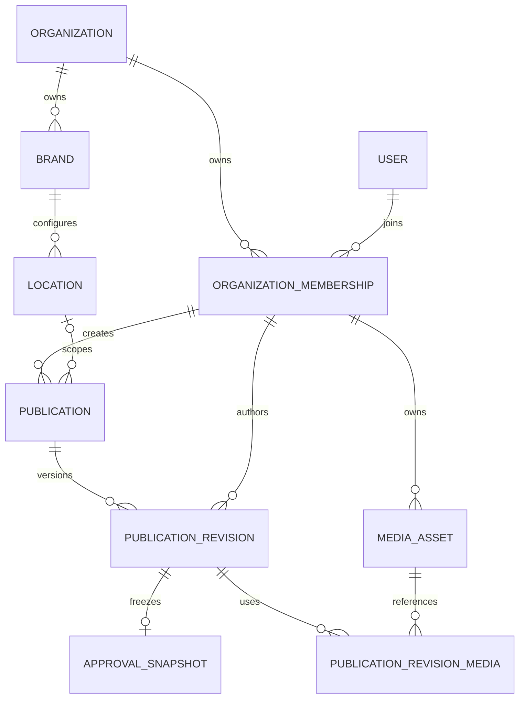

# Database

PostgreSQL es la fuente de verdad de publicaciones, revisiones, aprobaciones,
medios y ownership. Este workspace contiene el límite de infraestructura
aprobado en `ADR-006`: Prisma no entra en `packages/domain` ni en contratos
públicos; los casos de uso reciben repositorios tipados.

## Modelo entidad-relación inicial



`Organization` es la raíz de tenant. `User` es una identidad global y sólo
adquiere acceso mediante `OrganizationMembership`; por eso esas dos tablas son
las únicas que no llevan `organization_id`. Toda relación entre filas de
negocio usa una clave compuesta que incluye `organization_id`: conocer un UUID
válido de otra organización no alcanza para relacionarlo ni recuperarlo.

## Invariantes persistidas

- Los estados son enums de PostgreSQL alineados con `packages/domain`.
- Los listados críticos tienen índices por organización + estado y por
  organización + fecha programada.
- Todas las relaciones de negocio usan `ON DELETE RESTRICT`; no existe una
  cascada que borre historial o medios de manera implícita.
- Una revisión numera sus versiones dentro de una publicación.
- Un medio `available` exige hash, MIME, tamaño, versión, clave y URL HTTPS.
- Una fila de `approval_snapshots` es append-only mediante trigger y guarda el
  documento completo —contenido, diseño, marca y metadatos de medios—. Sus
  claves foráneas conservan linaje, pero no hacen falta para reconstruir la
  pieza aprobada.
- Una transición actualiza estado y versión mediante compare-and-swap y agrega
  una fila append-only a `publication_state_transitions` dentro de la misma
  transacción. Fallos actuales conservan código, mensaje seguro, reintento y
  timestamp.

## Comandos

```bash
pnpm db:generate
pnpm db:migrate:dev --name nombre
pnpm db:migrate:deploy
pnpm db:seed
pnpm db:test
```

Prisma 7 toma el schema, las migraciones y el seed desde
[`../../prisma.config.ts`](../../prisma.config.ts). El cliente se genera dentro
de `src/generated/` durante build y no se versiona.

`pnpm db:test` crea una base efímera en el PostgreSQL local, aplica la historia
desde cero, ejecuta el seed y las pruebas con dos organizaciones, revisa los
planes de consultas, ejecuta el `down.sql` de la última migración y vuelve a
aplicarla. La base efímera se elimina incluso ante fallo.

Prisma Migrate no ejecuta migraciones descendentes automáticamente. Cada
migración reversible conserva un `down.sql` revisado; usarlo fuera de la prueba
requiere el procedimiento operativo, respaldo y autorización correspondientes.
Nunca se usa `db push` en ambientes compartidos.

El seed es idempotente y exclusivamente de desarrollo: crea Aramayo, una
identidad `.invalid`, una membresía con todos los roles para pruebas, la marca y
dos ubicaciones desde `@aramayo/brand-knowledge`. No asigna responsables reales.

La instancia local y sus procedimientos están documentados en
[`../local/README.md`](../local/README.md). PostgreSQL `17.9` queda fijado;
cambiar de major exige repetir migraciones, rollback, backup y restauración.
