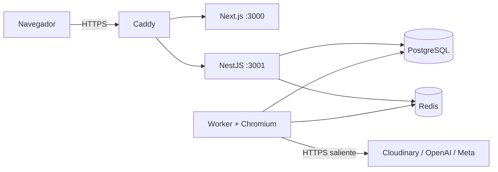

# Despliegue en VPS dedicado

## Estado y alcance

Este directorio prepara el piloto de Aramayo Content Platform para un VPS
dedicado de 4 vCPU, 8 GB de RAM y 75 GB de disco. Es scaffolding verificable:
no provisiona el servidor, no publica imágenes y no habilita producción.

El despliegue remoto sigue condicionado por las puertas de Fase 7, backup
externo probado, credenciales separadas y acceso al VPS. Ningún comando
versionado despliega remotamente. El smoke crea y elimina sólo un proyecto
Docker local con nombre fijo y credenciales falsas; no usa el `.env` del
desarrollador ni una base persistente real.

El host base fue provisionado y verificado el 2026-07-29. Todavía no contiene
la aplicación, bases, volúmenes de aplicación ni secretos de proveedores.

## Topología



- Caddy es el único servicio que publica puertos: `80/tcp`, `443/tcp` y
  `443/udp`.
- `backend` es una red Docker interna. PostgreSQL, Redis y el worker no tienen
  entrada pública.
- La API comparte `edge` sólo para recibir tráfico de Caddy y confía exactamente
  en un salto de proxy.
- La migración termina correctamente antes de iniciar API o worker.
- Los procesos de aplicación usan filesystem de solo lectura, usuario sin
  privilegios, límites de memoria y cierre ordenado.
- El worker comienza con concurrencia `1`; su imagen fija Playwright `1.62.0`,
  Node `24.18.0` y la ruta exacta de Chromium.

## Hostnames

Los registros DNS que se preparan en Donweb son:

| Tipo | Nombre en la zona | Destino | TTL inicial |
|---|---|---|---:|
| `A` | `content` | `144.217.91.115` | 300 |
| `AAAA` | `content` | `2607:5300:205:200::9f41` | 300 |
| `A` | `api.content` | `144.217.91.115` | 300 |
| `AAAA` | `api.content` | `2607:5300:205:200::9f41` | 300 |

Donweb completa `ferreteriaaramayo.com.ar`; no se crean CNAME ni se modifican
`@`, `www`, correo u Odoo. Los registros pueden propagarse antes del despliegue,
pero Caddy no se inicia hasta que API y panel estén listos para la verificación
remota.

Caddy obtiene y renueva certificados automáticamente cuando ambos registros A
resuelven al VPS y los puertos 80/443 están accesibles. `ACME_EMAIL` debe ser
una cuenta operativa real, no un email personal versionado.

## Archivos

- [`Dockerfile`](Dockerfile): targets inmutables `web`, `api`, `worker` y
  `migration`.
- [`compose.yaml`](compose.yaml): topología que consume imágenes etiquetadas por
  commit.
- [`compose.build.yaml`](compose.build.yaml): override local/CI para construir
  esos targets.
- [`Caddyfile`](Caddyfile): TLS, headers y reverse proxy para los dos dominios.
- [`.env.example`](.env.example): nombres y valores no secretos del ambiente.

## Verificación local

```bash
pnpm production:config
pnpm production:caddy
pnpm production:verify
pnpm production:build
pnpm production:smoke
```

`production:verify` usa exclusivamente placeholders públicos construidos por la
herramienta; nunca carga el `.env` real del repositorio. `production:build`
construye las cuatro imágenes con un tag local de validación, pero no las
publica. `production:smoke` crea un proyecto efímero, aplica migraciones,
comprueba readiness/web/Chromium y elimina sus contenedores y volúmenes al
terminar; nunca usa una base configurada por el desarrollador.

## Preparación del archivo de entorno remoto

Cuando exista acceso al VPS:

1. Crear un directorio operativo fuera del checkout, por ejemplo
   `/opt/aramayo-content/`.
2. Copiar `.env.example` a un archivo no versionado propio del ambiente.
3. Restringirlo al usuario de despliegue con modo `0600`.
4. Reemplazar `IMAGE_TAG` por el SHA exacto publicado y `IMAGE_REGISTRY` por el
   registry confirmado.
5. Generar contraseñas distintas y URL-safe para PostgreSQL y Redis:

   ```bash
   openssl rand -hex 32
   ```

6. Generar la llave activa de aplicación:

   ```bash
   openssl rand -base64 32
   ```

   Guardarla como `v1:<resultado>` en `TOKEN_ENCRYPTION_KEYS`.

7. Mantener vacíos los grupos OpenAI, Cloudinary y Meta hasta disponer de un
   conjunto completo de credenciales del ambiente correspondiente.

Docker Compose expande las contraseñas URL-safe dentro de `DATABASE_URL` y
`REDIS_URL`; no deben contener caracteres sin codificar. Una persona con acceso
administrativo a Docker puede inspeccionar el entorno de los contenedores, por
lo que el acceso al daemon equivale a acceso a secretos.

## Datos y recuperación

Los volúmenes `postgres_data`, `redis_data`, `caddy_data` y `caddy_config`
persisten reinicios y actualizaciones. Esto no es un backup:

- un snapshot del mismo VPS no reemplaza una copia externa;
- PostgreSQL necesita backup cifrado fuera del proveedor y restauración
  ensayada;
- Redis transporta trabajo y puede reconstruirse desde PostgreSQL;
- referencias Cloudinary se validan después de restaurar.

El proveedor/destino del backup externo y los objetivos RPO/RTO siguen
pendientes. No se habilitará el piloto como producción hasta cerrar
[`P7-T04`](../../docs/phases/PHASE-7-PRODUCTION.md).

## Baseline remoto verificado

- Ubuntu `26.04 LTS` x86-64 con kernel `7.0.0-28`;
- 4 vCPU, 7,6 GiB de RAM, 2 GiB de swap y 72 GB útiles en ext4;
- Docker Engine `29.6.2`, Buildx `0.35.0` y Compose `5.3.1` desde el
  repositorio oficial;
- SSH por clave únicamente para `ubuntu`; root, contraseña, teclado interactivo
  y X11 deshabilitados;
- UFW activo para IPv4/IPv6: sólo `22/tcp`, `80/tcp`, `443/tcp` y `443/udp`;
- AppArmor y timers de actualizaciones/fstrim activos;
- `/opt/aramayo-content` con modo `0750`; entorno y backups locales con modo
  `0700`;
- Caddy `2.11.4` descargado por el digest fijado y ejecutado sin error;
- ningún contenedor activo y sólo SSH escuchando al cerrar la preparación.

Docker desvía los puertos publicados antes de las reglas de UFW. La garantía de
exposición depende también del validador de Compose: sólo Caddy puede publicar
puertos; PostgreSQL y Redis nunca declaran `ports`.

## Pendientes antes del despliegue

- decidir registry y publicar imágenes por SHA;
- confirmar el email operativo de ACME;
- confirmar destino de backup externo;
- cargar secretos sin copiarlos a terminales, issues o logs;
- verificar la propagación de los cuatro registros Donweb;
- ejecutar staging/rollback según `P7-T07` antes del piloto.

## Fuentes

- [HTTPS automático de Caddy](https://caddyserver.com/docs/automatic-https)
- [Reverse proxy de Caddy](https://caddyserver.com/docs/caddyfile/directives/reverse_proxy)
- [Orden y healthchecks en Docker Compose](https://docs.docker.com/compose/how-tos/startup-order/)
- [Imagen oficial de Playwright](https://playwright.dev/docs/docker)
- [Instalación oficial de Docker en Ubuntu](https://docs.docker.com/engine/install/ubuntu/)
- [Docker y reglas de firewall](https://docs.docker.com/engine/network/packet-filtering-firewalls/)
- [Firewall de Ubuntu](https://documentation.ubuntu.com/server/how-to/security/firewalls/)
